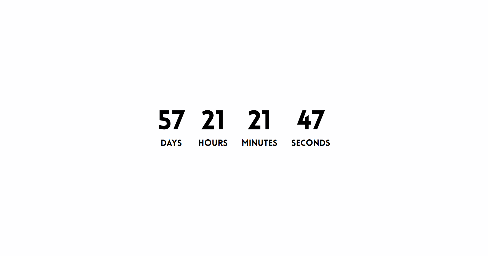

# Countdown
A minimalist web page that counts down to the date in the URL

## How to use
Put any datestring as the url path and the page will display a countdown timer to the datetime in question.

This app uses momentjs, so will do some powerful date parsing. 

If it cannot parse your date string the page will display an error.

## Screenshot

